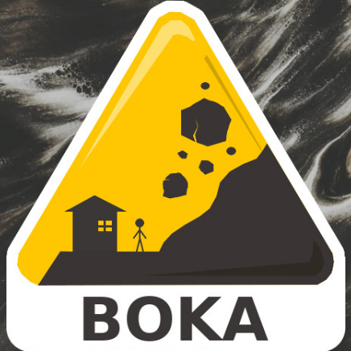
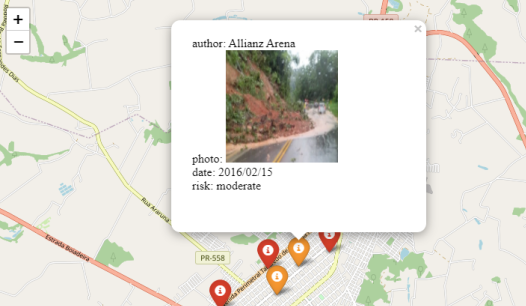
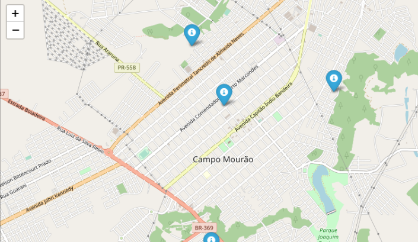

## 🌉 Build, 🔎 Observe, 📚 Know, 🚩 Alert!

### Chatbot to help identify and communicate risk areas.
BOKA was created to intermediate the


## Dashboard
 - **Interactive maps to communit**



 - **Community support**



## API

### Call Functions 📞

```
$ python apiservice/api.py arg1 arg2
```
Where:
 - `arg1` is `0` to insert CEP or `1` to insert `long;lat`;
 - `arg2` is the information;
 - `arg3` (optional) is an filename to response JSON.

A response JSON file will be created in the `api/apiservice/response/` folder.

### Run 🏁

1. Clone the repository, running the following command in your chosen folder
```
$ git clone git@github.com:romavini/boka.git
$ cd boka
```

2. (Optional) Create a virtual environment
```
$ virtualenv venv
$ venv\Scripts\activate.bat
```

3. Create a `.env` in the root folder with the following information:
```python
TOMTOM_API_KEY =  # Get your key here: https://developer.tomtom.com/how-to-get-tomtom-api-key
```

4. Install project dependencies
```
$ pip install -r requirements.txt
```

5. Run the application.
```
$ python apiservce/main.py
```
