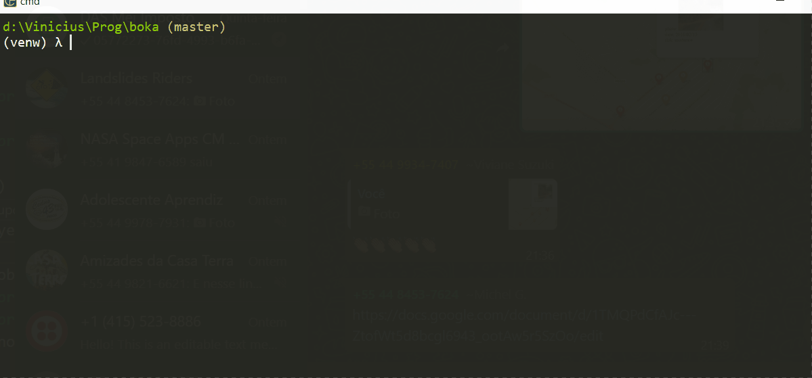

# BOKA
🌉 Build, 🔎 Observe, 📚 Know, 🚩 Alert!

### Return the Landslide risk given CEP or Longitude and Latitude

&nbsp; [](https://developer.tomtom.com/search-api/search-api-documentation) &nbsp; [](https://apicep.com/api-de-consulta/) &nbsp; [](https://gpm.nasa.gov/data/visualizations/precip-apps)



## Call Functions

```python
geo_data = GeoData()

data = geo_data.load_nasa_data()

[logitude, latitude] = geo_data.long_lat_from_cep
```

## Run 🏁

1. Clone the repository, running the following command in your chosen folder
```
$ git clone git@github.com:romavini/boka.git
$ cd boka
```

2. (Optional) Create a virtual environment
```
$ virtualenv venv
$ venv\Scripts\activate.bat
```

3. Create a `.env` in the root folder with the following information:
```python
TOMTOM_API_KEY =  # Get your key here: https://developer.tomtom.com/how-to-get-tomtom-api-key
```

4. Install project dependencies
```
$ pip install -r requirements.txt
```

5. Run the application.
```
$ python apiservce/main.py
```
